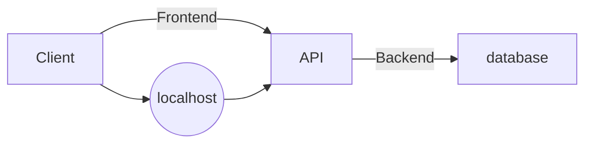

# Groupe de daniel_t 882683

## Installation de docker sous linux
Mise à jour du système
```sh
sudo apt update
sudo apt upgrade
```
Installation des pré-packet requis avec l'installation de docker

```sh
sudo apt-get install  curl apt-transport-https ca-certificates software-properties-common
```
Ensuite, nous ajoutons le dépôt :
```sh
sudo add-apt-repository "deb [arch=amd64] https://download.docker.com/linux/ubuntu $(lsb_release -cs) stable"
```
Après cela, il suffit de mettre à jour les informations du dépôt :
```sh
sudo apt update
```

On a presque fini ! Utilisez la commande apt pour installer Docker :
```sh
sudo apt install docker-ce
````
Vérifier le statut du docker
Une fois l’installation terminée, il est conseillé de vérifier l’état du service.

````sh
sudo systemctl status docker
````

L'installation est désormais terminée !!

## Architecture de notre projet

Voici un shema montrant les connexions entre les différents contenaires

Vous pouvez observez 2 networks:

- Le **Frontend** qui relie notre client à l'API.
- Le **Backend** qui permet à l'API de faire des requetes sur notre database.

## Les containers

- La **Database** à été réalisé en *MySQL*, un  fichier de configuration setup.sql à été ajouté afin de créer la DB, la table user et d'insert 2 exemples d'utilisateurs avec id, username, mail et password.

- L'**API** est un serveur php qui effectue une requete *Get*  grace à un fichier index.php sur la **Database** afin de recuperer les informations des deux utilisateurs et return le tout sous forme de fichier .json

- Le **Client** qui permet l'affichage des informations recupérer grace à la requete de l'**API** du fichier json à ete réalisé en *React.js*, il renvoie donc son port 7777 sur le localhost de notre environnement "Mère", ici un linux.

La persistance des données sur la Database est réalisé grâce au *Volumes Docker* spécifiés dans notre docker-compose.yml

## Bonus

Nous avons choisie de mettre en place un autre container avec *Laravel* d'installer dessus. 
Il expose sur le port 7778.
Plusieurs routes et migrations son disponible pour faire différents types de requetes sur une Database.

Vous pourez tester les différents routes get,put,delete,post en faisant  un import sur *Postman* de ce lien: https://www.getpostman.com/collections/b4ae53b4bd3c05f34b97